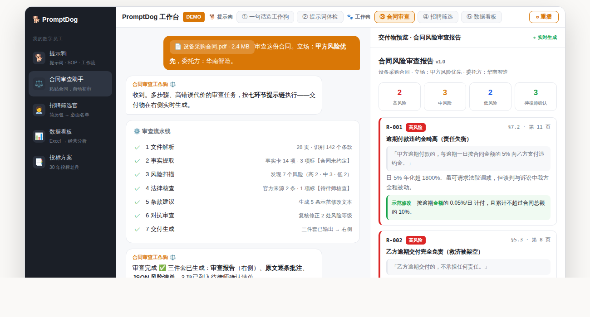

<div align="center">

# 🐕 PromptDog

**Turns what you can't articulate into agents that work.**

[🌐 Live Demo](https://prompt-dog.vercel.app/) · [⚡ Quick Start](#-quick-start-30-seconds) · [🏠 The Kennel](#-the-kennel-ready-to-work-workdogs) · [中文](README.md)



*↑ A WorkDog on duty: one sentence + one contract → a clause-level risk report, live. ([animated demo](https://prompt-dog.vercel.app/), demo UI in Chinese)*

</div>

---

## The problem

The biggest barrier to using AI isn't prompting skill — it's that **people can't articulate what they want**. Tools ask open-ended questions ("What are your QA standards?") that users can't answer. PromptDog flips this: **it never asks open questions — it proposes.** Multiple-choice cards with industry-standard options pre-starred. Reply "all recommended" and you're through.

## ⚡ Quick start (30 seconds)

**Option 1: Coding agents (Codex / Claude Code — best experience)**

```bash
git clone https://github.com/shandianT/Prompt-dog
```

Then add a route to your `AGENTS.md`:

```markdown
For any prompt-writing / prompt-optimization / SOP / workflow-design task,
read Prompt-dog/SKILL.md and follow its process strictly.
```

**Option 2: Any chat AI** — copy [`assets/system-prompt.md`](assets/system-prompt.md) (below the divider) into the system-prompt box or the first message.

**Option 3: Single-persona platforms (SoWork / Coze)** — copy the three fields from [`assets/persona-single-field.md`](assets/persona-single-field.md).

## What one interaction looks like

> **You**: I run a cross-border e-commerce store, I want AI to QA my customer-service chats
>
> **PromptDog**: Medium-complexity task needing industry know-how — I'll design an SOP. One thing to confirm, reply "all recommended" to pass:
> **Q1 QA dimensions?** (multi-select) A. Response time ★　B. Script compliance ★　C. Resolution rate ★　D. Empathy　E. Other
>
> **You**: all recommended
>
> **PromptDog**: Effective: all ★. (Delivers the full SOP + assumption list + a beginner's guide.)

Zero open-ended questions. You typed fewer than ten words.

## 🏠 The Kennel: ready-to-work WorkDogs

A WorkDog is a scenario-specific agent asset package produced by PromptDog — drop the folder into any agent workspace and it's on duty, with launch commands, a retro flywheel, and regression gates built in:

| WorkDog | What it does | Where |
|---|---|---|
| 📑 Bid Writing | Parse tender → scoring matrix → draft per scoring point → knockout-clause checks → mock evaluation | [`kennel/标书撰写Agent`](kennel/标书撰写Agent) |
| ⚖️ Contract Review | 7-stage first-pass review, three deliverables (report / annotations / JSON), law-firm red lines | [`kennel/合同审查Agent`](kennel/合同审查Agent) |
| ✍️ Content Marketing | "Trust through transparency" methodology, corpus-grounded (no fabricated numbers), tri-cut per platform | [`kennel/内容营销Agent`](kennel/内容营销Agent) |

## How it guarantees quality

**Size the job before doing the job**: simple ask → one great prompt; multi-step → an SOP; complex → a staged pipeline with checks; large → an AI team that reviews each other.

Four safeguards: acceptance criteria agreed before work starts; critical claims cross-checked; an adversarial reviewer before delivery; a hard stop-loss after three rounds — it never spins forever. See the methodology docs under [`references/`](references/).

## vs. traditional prompt tools

| | Traditional | PromptDog |
|---|---|---|
| Clarification | Open-ended questions | Multiple choice + ★ defaults, "all recommended" to pass |
| Complexity | One prompt for everything | Graded output: prompt / SOP / pipeline / AI team |
| Quality | Luck | Acceptance-first + adversarial review + stop-loss |
| Deliverable | A wall of text | A reusable asset package (with retro & regression) |

## Contributing

Issues and PRs welcome — especially industry candidate libraries and new WorkDog scenarios. A ⭐ is the best support.

## License

See [LICENSE](LICENSE).
