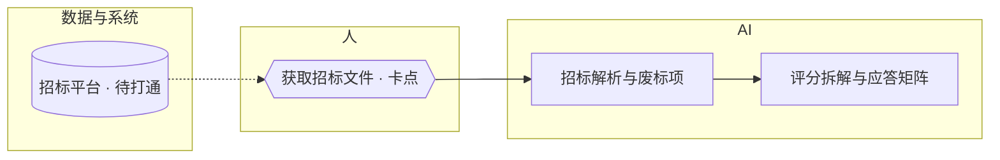

# 流程重构模式：把一个部门的流程画成能看出卡点的地图

**何时读**：入口路由判为「流程重构」——用户描述的是一个部门或公司的现有流程（谁做什么、什么顺序、卡在哪、用哪些系统），或问「我们这套流程哪些能交给 AI」。流程本身不判级：先出图与诊断，打包建议里的每只工作狗才各自走主循环判级、建包。

**产出一句话**：一张目标态流程图（泳道 + 三种标记 + 五种线）、一份诊断清单（卡点 / 缺口 / 待打通各怎么解）、一份打包建议（AI 泳道的哪几步合成哪只工作狗，犬舍已有的直接复用）。图是主产物，工作狗是图的派生物。

## 五问即验收

不看任何解释，30 秒内能从图上答出五问，图才算完成：

① 哪些步骤自动　② 人在哪几步（人审 / 人定）　③ 卡在哪　④ 缺什么　⑤ 要打通什么

图的顶部固定五个数字：`自动 N · 人 N · 卡点 N · 缺口 N · 待打通 N`。诊断清单就是③④⑤的展开。

## 六步

**第 0 步：材料先行，不问先画。** 用户给了材料（流程文档、岗位说明、聊天记录、表格、系统清单）→ 从材料反推现状图，每个节点记来源（`src`）；没材料 → 按行业候选库里的同类流程出草稿，写「H 现状按行业惯例推断」。没有空白图：永远先给一张可纠错的图，用户只做纠错。

**第 1 步：抽节点，分泳道。** 节点五类 `kind`：`human` 人 / `dog` 工作狗 / `skill` 技能 / `know` 行业 know-how / `data` 数据与系统。泳道默认按谁来做，三条：AI（`auto`）/ 人（`review` 人审、`decide` 人定）/ 数据与系统。用户关心交接、部门墙时切「按部门」泳道，节点不变只换分带。人的节点记负责人或部门、时限、通知渠道；系统节点记打通方式（接口 / RPA / 文件 / 人工）与方向（读 / 写 / 读写）。

**第 2 步：打标记。** 三种，名字固定，不发明同义词：

| 标记 | 定义 | 长在哪 |
|---|---|---|
| 卡点 `block` | 流程在等人：等出结果、等审批、等材料 | 人的节点 |
| 缺口 `missing` | 缺一个组件或材料才能做：没有的技能、没沉淀的 know-how、不全的库 | 技能 / know-how / 数据节点 |
| 待打通 `pending` | 人在两个系统之间搬数据 | 数据节点及指向它的线 |

**第 3 步：连线，两条线不混。** 控制线：顺序 `seq`、退回 `back`；数据线：数据 `data`、待打通 `pending`、回填 `loop`。每条线写产物名（「应答矩阵」「审批通过」），产物类型 `dtype` 六类：`file` / `struct` / `text` / `decision` / `event` / `sys`。决定类节点至少两条出线（投 / 不投）。回填线是飞轮：结果回到素材库或现状图，没有回填线的流程不会变好。

**第 4 步：出目标态。** 对每个人的步骤问三问：能不能自动做（→ 变 `skill`/`dog`，`role=auto`，记 `was=human`）；必须有人看一眼（→ `review`）；不可逆前必须人拍板（→ `decide`，受保护）。系统节点写了打通方式，待打通线就变数据线。每处改动同时保留 `was`（原来怎么做）与 `target`（应用后的状态），同一张图才能切「对照现状」。**不可逆动作（递交、发送、付款、签署）前的人定节点不许自动化**——这就是 SKILL.md 的人工确认点规则在图上的样子。

**第 5 步：诊断清单与打包建议。** 诊断按卡点 → 缺口 → 待打通列，每条一句「怎么解」加「解完变成什么」。打包：AI 泳道里连续且共享上下文的步骤合成一只工作狗；犬舍已有的（合同审查、标书撰写、内容营销）直接复用并标环节数；每只狗的环节遵守尺寸规则（见 `run-loop.md`：一个环节一个上下文能做完，做不完就拆）。打包建议里的每只狗转主循环判级、建包，主控文件写明「服务流程：<流程名> 节点 n3/n5/n7」，复盘才能回流到图。

**第 6 步：交付。** 顺序固定：本质一句话 → 五问数字 → 图（有画布给 JSON，没有给泳道表 + Mermaid）→ 诊断清单 → 打包建议 → H 假设 → 可选纠错卡。交付话术：「图先按材料画好了；说节点编号就能改，说『按这个建』就开始建第一只狗」。

## 唯一的一张卡（只在架构级不确定时出，否则预填交付）

| 题 | 候选 | ★ 规则 |
|---|---|---|
| 范围：画哪一段 | A. 端到端（从触发到交付）★ / B. 只画某部门内部 / C. 其他 | 材料覆盖到哪画到哪 |
| 泳道 | A. 按谁来做 ★ / B. 按部门 | 默认 A；用户问交接、部门墙时 B |
| 楔子：先建哪只狗 | A. 卡点最多的 AI 段 ★ / B. 犬舍已有可复用的 / C. 用户指定 | 先解卡点，其次复用 |

通知渠道、时限、打通方式这类内容级项一律预填写 H，不成题。用户说「直接做」→ 全 ★。

## 泳道语义（改分类、拖动时的规则；画布与文本同一套）

| 动作 | 结果 | 提示 |
|---|---|---|
| 人的步骤 → AI 泳道 | 变技能节点，自动，标缺口，记「原：人做」 | 「X」标为要自动化：还缺一个组件来做它 |
| AI 节点 → 人泳道 | 角色改人审，类型不变 | 「X」改为人审 |
| 步骤节点 → 数据泳道 | 弹回 | 步骤节点不能放进数据泳道 |
| 数据节点 → 其他泳道 | 弹回 | 系统节点留在数据与系统泳道 |
| 部门泳道下跨道 | 改负责人；跨道连线视为交接并高亮 | 交接处最容易长卡点 |

## 数据契约

字段定义在 `design/workbench/flow.schema.json`（工作台画布读同一份）。最小示例：

```json
{
  "name": "投标流程", "essence": "按评分表答题，让专家无处扣分",
  "lanes": { "mode": "role" },
  "nodes": [
    { "id": "n2", "kind": "human", "role": "decide", "name": "获取招标文件", "sub": "商务 · 刷平台下载",
      "flag": "block", "owner": "商务", "sla": "当天",
      "note": "每天人工刷招标平台，常漏标。", "fix": "招标平台打通后改关键词监控自动拉取。",
      "target": { "kind": "skill", "role": "auto", "flag": "ok" } },
    { "id": "s2", "kind": "data", "name": "招标平台", "sub": "公告 · 文件下载",
      "flag": "pending", "was": "manual", "method": "manual", "dir": "read",
      "target": { "flag": "ok", "method": "rpa" } }
  ],
  "edges": [
    { "id": "e1", "from": "s2", "to": "n2", "kind": "pending", "label": "公告、招标文件", "dtype": "sys" }
  ]
}
```

## 无画布时的文本形态

泳道表（每行一个节点：id / 泳道 / 名称 / 谁来做 / 标记 / 原来 / 怎么解）加一段 Mermaid，标记写进节点名，数据线与待打通用虚线：



## 图档位由环境决定（写成 H）

探测顺序：可用技能列表 → 用户原话（「我这里只有普通对话窗口」）→ 默认文本图。写成假设：「H 图按<档>，依据：环境<有 / 无>画图技能」。任何画图技能都不是必备依赖，缺了降档不缺图。

| 档 | 环境 | 产物 | 额外验收 |
|---|---|---|---|
| 高保真 | 有 design / dataviz / 画布类技能 | flow JSON → 画布或图片，随附 JSON | 五问 30 秒 |
| 文本图 | 只能输出代码块 | flow JSON → Mermaid（上节模板）或 SVG | Mermaid 无语法错 |
| 泳道表 | 连代码块都不渲染 | 七列表：id / 泳道 / 名称 / 谁做 / 标记 / 原来 / 怎么解 | 七列齐 |

四个镜头都从同一份 JSON 派生，不另发明图的 schema：泳道流程图（`nodes` / `lanes` / `flag`）· 环节链（`children` 子图）· 对照现状（`was` / `target`）· 运行态（`验收清单.json` 的 passes 映射到节点，复盘时画）。屏幕流转不画图（SPEC 屏幕清单表即图），停机状态不画图（run-loop.md 停机表即图），不画装饰图、没有产物名的箭头、没有数据的趋势图。

## 示例：投标流程（楔子场景）

五问数字：自动 7 · 人 7（人审 1 / 人定 6）· 卡点 2 · 缺口 1 · 待打通 4。连线 23 条：顺序 14、数据 3、待打通 4、退回 1、回填 1。

| id | 泳道 | 名称 | 谁来做 | 标记 | 原来 | 怎么解 |
|---|---|---|---|---|---|---|
| n1 | 人 | 商机进入 · 销售 | 人定 | — | — | — |
| s1 | 数据 | CRM | — | 待打通 | 手工搬 | 商机与客户资料只读同步 |
| n2 | 人 | 获取招标文件 · 商务 | 人定 | 卡点 | — | 平台打通后改关键词监控自动拉取，变自动 |
| s2 | 数据 | 招标平台 | — | 待打通 | 手工搬 | RPA 或接口订阅公告并下载 |
| n3 | AI | 招标解析与废标项（标书撰写 · 环节 1） | 自动 | — | 人做 | — |
| n4 / n14 | 人 | 投不投 → 投 / 不投·归档 | 人定 | — | — | 决定类分支，两条出线 |
| n5 / n7 | AI | 评分拆解与应答矩阵 / 分章撰写（标书撰写 · 环节 2、3） | 自动 | — | 人做 | — |
| n6 | AI | 素材检索（技能） | 自动 | — | 人做 | — |
| s3 | 数据 | 素材库 | — | 缺口 | 手工搬 | 补业绩扫描件与证书，投标后回填 |
| n8 | AI | 合同条款审查（复用合同审查狗，7 环节子图） | 自动 | — | 人做 | — |
| n9 | 人 | 报价 · 财务 | 人定 | 卡点 | — | ERP 成本接口加报价模板，人只定折扣，变人审 |
| s4 | 数据 | ERP 成本 | — | 待打通 | 手工搬 | 只读接口 |
| n10 | AI | 合规自查与模拟评审（对抗审查） | 自动 | — | 人做 | — |
| n11 | 人 | 领导审批 | 人审 | — | — | 不通过退回报价（退回线） |
| s5 | 数据 | OA 审批 | — | 待打通 | 手工搬 | 审批单自动发起与回写 |
| n12 | 人 | 递交 · 人工确认点 | 人定 | — | — | 不可逆，受保护 |
| n13 | AI | 复盘回填 → 素材库 | 自动 | — | 新增 | 回填线回到素材库 |

诊断清单（示例）：
- 卡点 n2 获取招标文件：打通 s2 后改自动拉取 → 卡点消失，商务从每天刷平台变成只看推送
- 卡点 n9 报价：打通 s4 后先自动出报价框架 → 人只定折扣，人定变人审
- 缺口 s3 素材库：补齐扫描件与证书，n13 每次投标后回填 → 命中率随次数上升
- 待打通 s1 / s2 / s4 / s5：接口或 RPA，方向见节点

打包建议（示例）：标书撰写狗复用（n3 / n5 / n7 / n10，4 环节）；合同审查狗复用（n8）；新建技能 2 个：素材检索 n6、复盘回填 n13。先建顺序：解卡点的 n2 自动拉取（新技能）→ 补 s3 → 其余复用即可上岗。

完整节点与连线数据在 `design/workbench/flow.py`；示例数字均为演示值。

## 图的八条判断标准

做任何取舍先问服务哪一条，答不上来就不加：
1 先读懂再动手（五问 30 秒）　2 两条线不混（控制线 / 数据线）　3 节点即组件、组件即资产（工作狗是子图，框选可打包）　4 类型约束替代规则说明（端口即产物类型，不兼容连不上）　5 一张图三种看法（目标态 / 对照现状 / 运行态，位置不变只变标注）　6 人机边界显式且可拖（跨泳道即决策）　7 默认值先行（AI 先出图，人只纠错）　8 最短路径（新建与连线一个动作，一切可撤销）
